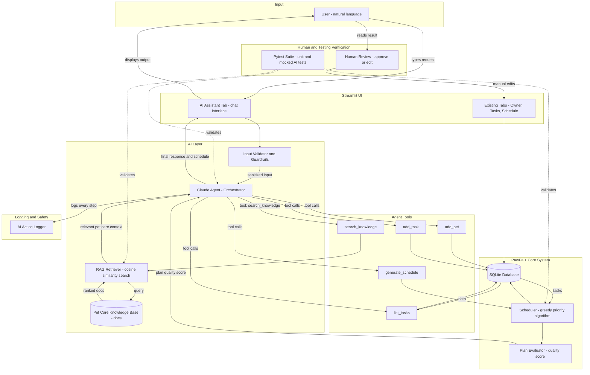

# PawPal+ AI System Diagram



---

## Component Summary

| Component | Role |
|---|---|
| **User** | Provides natural language input (e.g. "Set up a weekly routine for my puppy") |
| **Input Validator / Guardrails** | Sanitizes and rejects unsafe or malformed input before it reaches the agent |
| **Claude Agent** | Orchestrates the entire response — decides which tools to call and in what order |
| **RAG Retriever** | Searches the pet care knowledge base using vector/cosine similarity and returns relevant context |
| **Pet Care Knowledge Base** | Curated documents: feeding guides, vaccination schedules, breed-specific needs |
| **Agent Tools** | Discrete actions the agent can take: add pets, add tasks, generate a schedule, list tasks, search knowledge |
| **Scheduler** | Existing greedy priority algorithm — unchanged, called via the `generate_schedule` tool |
| **Plan Evaluator** | Scores the generated plan (compliant tasks / total tasks × 100%) and feeds the score back to the agent |
| **SQLite Database** | Persistent storage for all users, pets, and tasks |
| **AI Action Logger** | Records every tool call, retrieval query, and agent decision for auditing and debugging |
| **Human Review** | User reads the AI output and can approve, edit, or override via the existing Streamlit tabs |
| **Pytest Suite** | Automated tests covering tools, retriever accuracy, and scheduler correctness (mocked Claude calls) |

## Data Flow Summary

```
User Input
  → Guardrails (validate)
    → Claude Agent (plan)
      → RAG Retriever (retrieve context from knowledge base)
      → Agent Tools (act: add tasks, generate schedule)
        → Scheduler + Evaluator (run algorithm, score plan)
          → Logger (record)
            → Streamlit UI (display)
              → Human Review (verify / edit)
                → Pytest Suite (automated regression checks)
```
